  

 

  <samp>
    Software engineer working on data systems — how they store, move, and reason about information. 
    Currently researching <b>MVDB</b>, a unified data layer that challenges polyglot persistence.
  </samp>

 
 

  

 
 

<h3 align="center"><samp>FEATURED ENGINEERING</samp></h3>

 

<table align="center">
  <tr>
    <td align="center" colspan="3">
       
      <a href="https://github.com/vmv09"><b>MVDB</b></a>
        
      A research-driven, next-generation database architecture — one unified data layer that absorbs application-side complexity and challenges traditional polyglot persistence.
        
      <samp>research &nbsp;·&nbsp; storage engines &nbsp;·&nbsp; write-path design &nbsp;·&nbsp; distributed systems</samp>
        
    </td>
  </tr>
  <tr>
    <td align="center" width="33%">
       
      <b>INSIGHT</b>
        
      Government platform serving 400+ institutions in production.
        
      <samp>public infrastructure</samp>
        
    </td>
    <td align="center" width="33%">
       
      <b>AI Medical Supply Chain</b>
        
      Intelligent forecasting and routing for healthcare logistics.
        
      <samp>applied ai · logistics</samp>
        
    </td>
    <td align="center" width="33%">
       
      <b>Enterprise Automation</b>
        
      Workflow automation platform for enterprise operations.
        
      <samp>platform engineering</samp>
        
    </td>
  </tr>
</table>

 
 

<h3 align="center"><samp>EXPERIENCE</samp></h3>

 

<table align="center">
  <tr><td align="right"><samp>DecisionX</samp></td><td>AI infrastructure — data &amp; forecasting systems</td></tr>
  <tr><td align="right"><samp>Quoqo Technologies</samp></td><td>Software engineering</td></tr>
  <tr><td align="right"><samp>Alstom</samp></td><td>Engineering — mobility systems</td></tr>
  <tr><td align="right"><samp>Government Software</samp></td><td>INSIGHT — platform serving 400+ institutions</td></tr>
</table>

 
 

<h3 align="center"><samp>PUBLICATIONS</samp></h3>

 

  <samp>IEEE</samp> &nbsp;—&nbsp; Peer-reviewed research publication
    
  <samp>BOOK CHAPTER</samp> &nbsp;—&nbsp; Applied engineering research

 
 

<h3 align="center"><samp>STACK</samp></h3>

 

<table align="center">
  <tr><td align="right"><samp>languages</samp></td><td><code>Python</code> &nbsp;<code>TypeScript</code> &nbsp;<code>SQL</code> &nbsp;<code>Java</code></td></tr>
  <tr><td align="right"><samp>data</samp></td><td><code>PostgreSQL</code> &nbsp;<code>Redis</code> &nbsp;<code>time-series</code> &nbsp;<code>query engines</code></td></tr>
  <tr><td align="right"><samp>systems</samp></td><td><code>Linux</code> &nbsp;<code>Docker</code> &nbsp;<code>distributed systems</code> &nbsp;<code>API design</code></td></tr>
  <tr><td align="right"><samp>ai</samp></td><td><code>forecasting</code> &nbsp;<code>LLM integration</code> &nbsp;<code>ML pipelines</code></td></tr>
</table>

 
 

<h3 align="center"><samp>GITHUB</samp></h3>

 

  
  

 
 

<h3 align="center"><samp>CONTACT</samp></h3>

 

  <a href="https://devmv.in"><samp>devmv.in</samp></a>
  &nbsp;&nbsp;·&nbsp;&nbsp;
  <a href="https://github.com/vmv09"><samp>github</samp></a>

 

  

